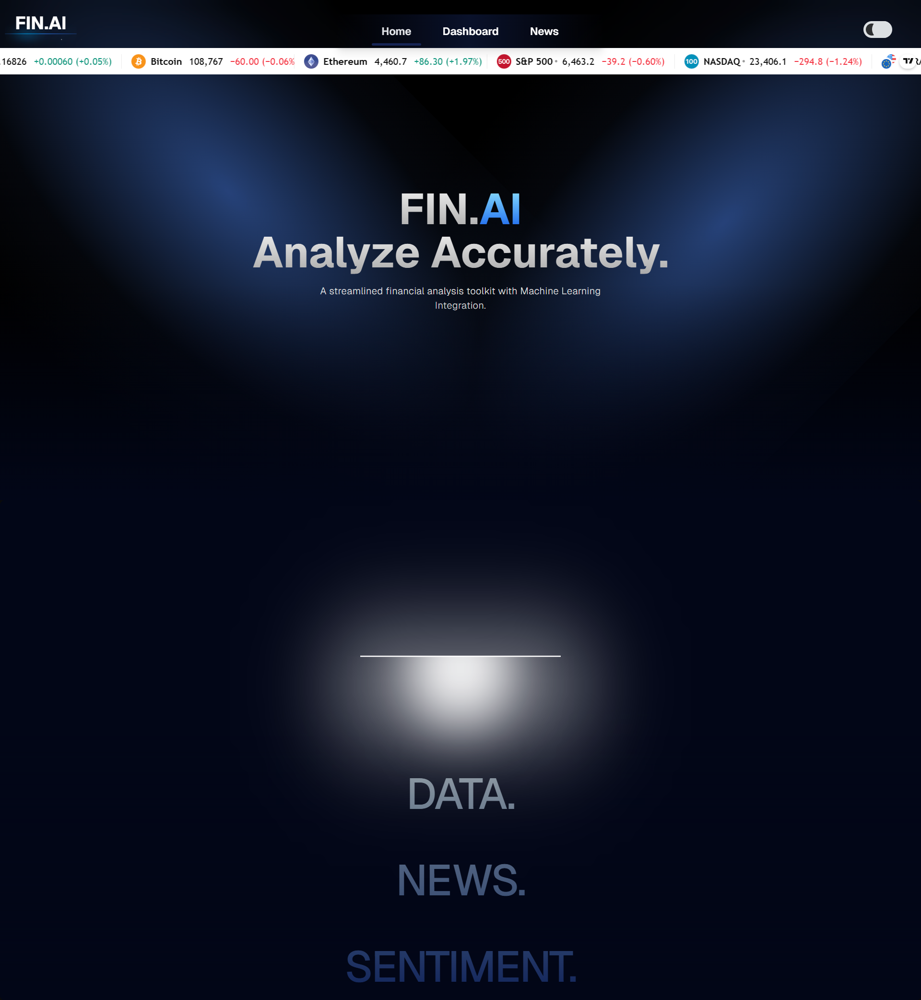
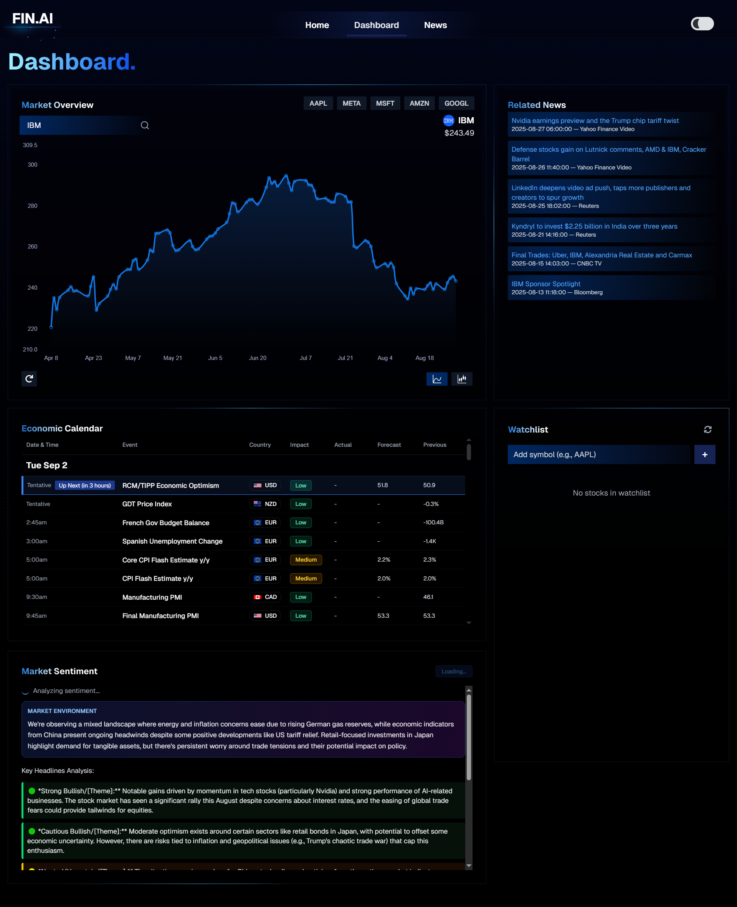
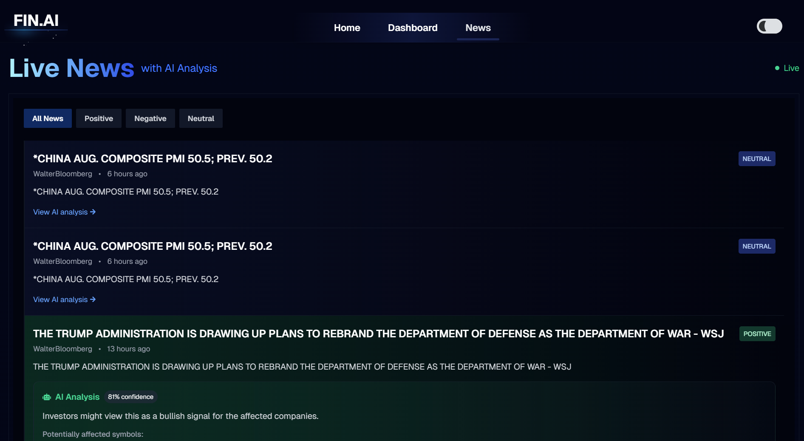

# FIN.AI - Financial Dashboard

A streamlined financial analysis toolkit with Machine Learning integration built with Next.js.

## Features

- **Real-time Market Data**: Live stock prices, crypto currencies, and market indices
- **Interactive Dashboard**: Comprehensive market overview with customizable charts
- **Live News with AI Analysis**: Real-time financial news with AI-powered sentiment analysis
- **Economic Calendar**: Track important economic events and indicators
- **Watchlist Management**: Add and monitor your favorite stocks and cryptocurrencies
- **Market Sentiment Analysis**: AI-driven market sentiment tracking with confidence scores

## Screenshots

### Home Page

*Landing page with AI-powered financial analysis branding*

### Dashboard Overview

*Main dashboard featuring:*
- Stock price tracking (IBM, META, MSFT, AMZN, GOOGL)
- Pirce charts with historical data
- Price updates and percentage changes
- Economic calendar with upcoming events
- Watchlist
- Market Sentiment analysis (based on current market headlines)

### Live News with AI Analysis

*AI-powered news analysis featuring:*
- Live financial news feed
- Sentiment classification (Positive, Negative, Neutral)
- Confidence scores for AI analysis
- Impact analysis on affected companies